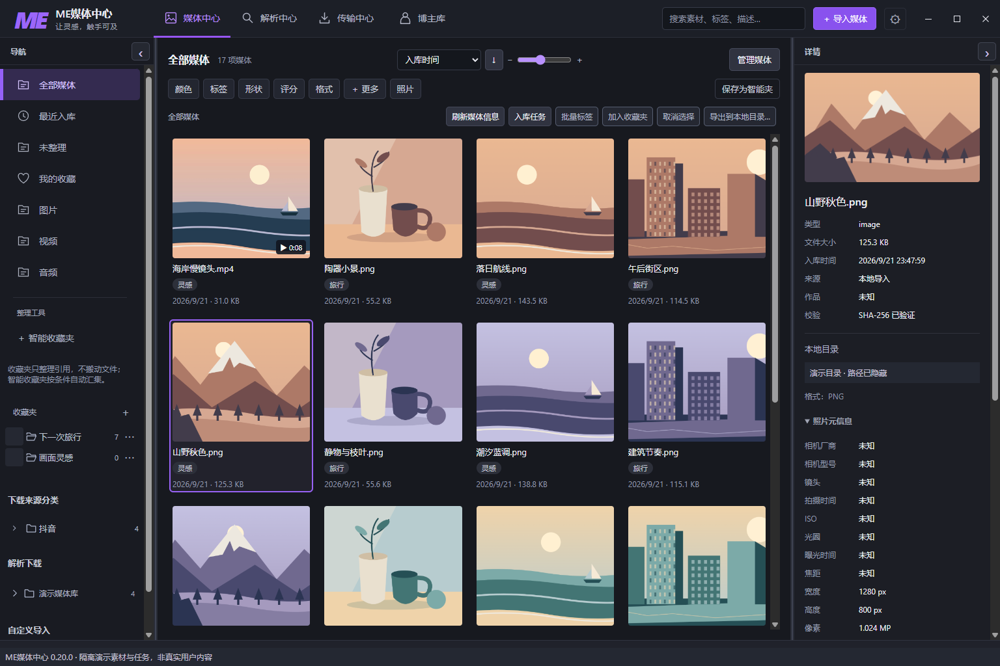
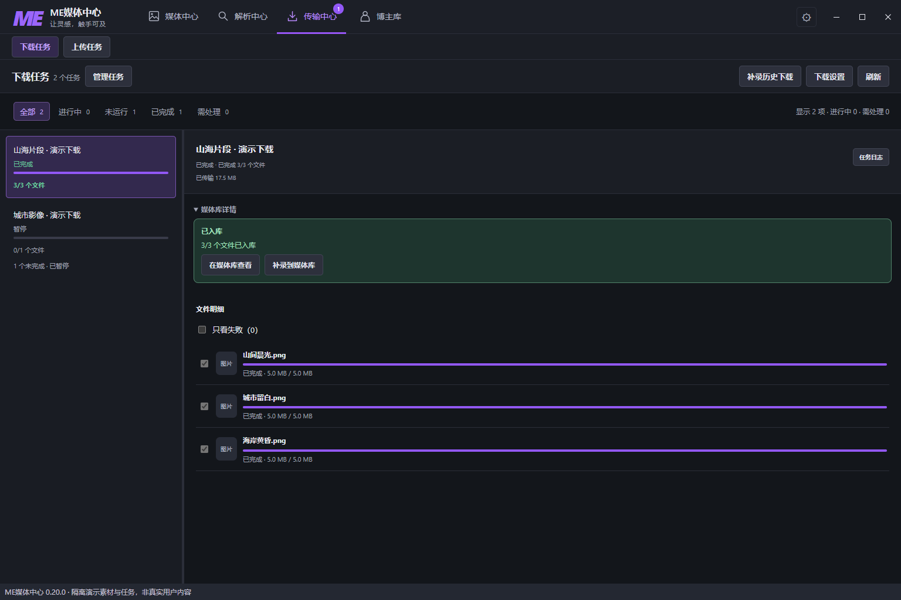
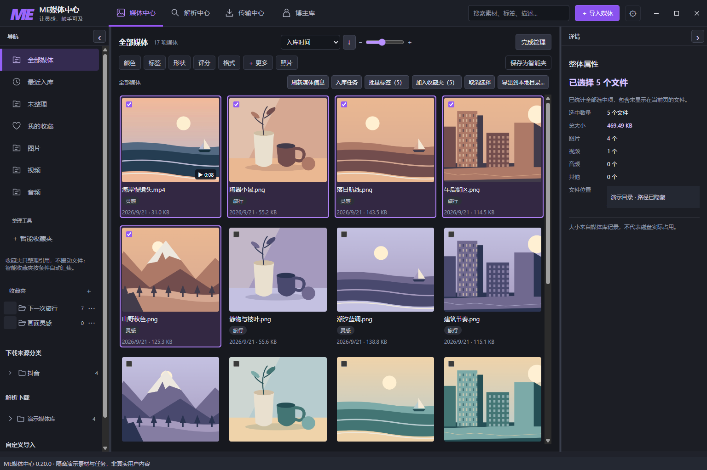
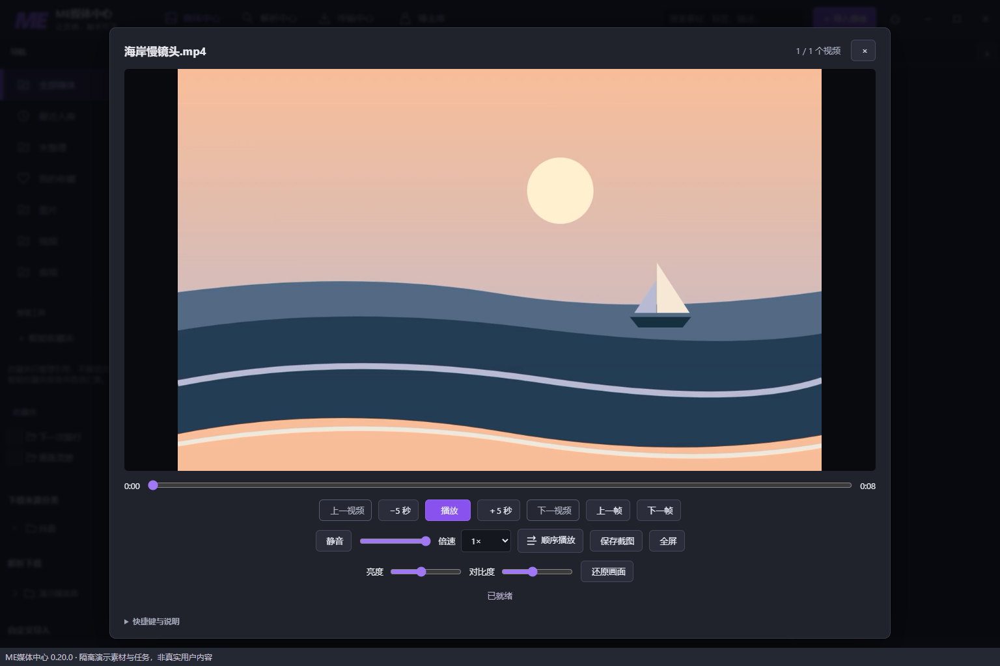
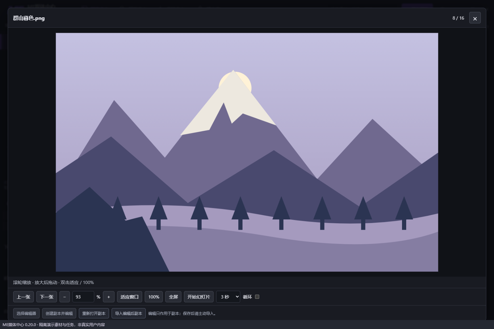
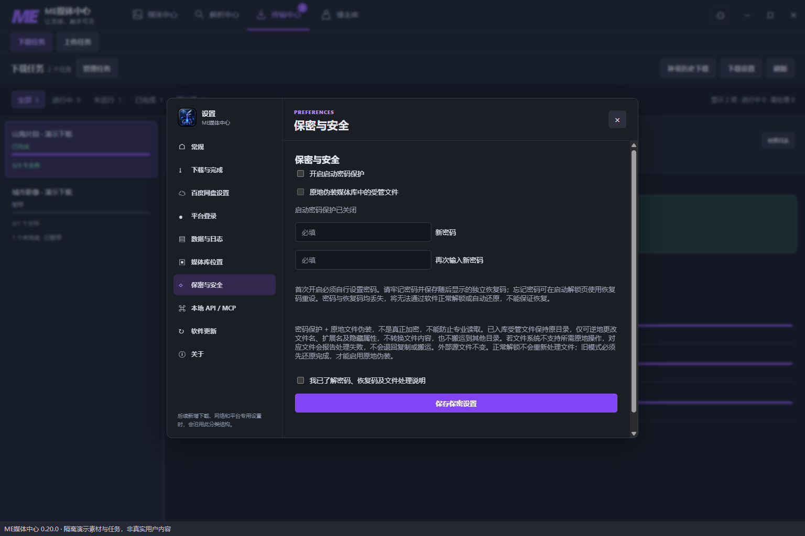

# ME媒体中心 0.20.0：这一次，把媒体管理也做好

看到喜欢的画面，我们会先把它保存下来。

一张旅途照片，一段城市视频，一组以后可能用得上的参考。慢慢地，文件越来越多。等到真正想用的时候，又要回忆：它来自哪里？放在哪个文件夹？还有没有同一组的其他画面？

收藏时计划满满，真要用时，只记得“我肯定存过”。

**ME媒体中心 0.20.0，把这些下载之后的事情接了起来。**

从解析、传输，到入库、整理、查看和导出，媒体现在有了一条更完整的使用路径。

## 打开以后，先看见你的内容

新的媒体中心采用三栏布局：左边是分类和收藏夹，中间是媒体网格，右边是当前内容的详情。

看一组照片时，可以收起侧栏，把空间留给画面；整理素材时，再展开详情，查看文件信息，写下标签和备注。栏宽和缩略图大小都可以调整。

图片、视频、音频集中在同一个工作区。记得名字就搜索，记得类型就筛选；从平台下载的内容，还能沿着平台、博主和媒体类型继续查找。

*媒体中心三栏界面。图中均为隔离演示素材。*

## 下载完一份，就能开始整理一份

过去，下载之后往往还要打开文件夹，重新挑选、分类。

现在，**完成的文件会逐个进入媒体库**。一批任务还在继续，已经完成的内容就可以先查看，不用一直等到最后。

传输中心会分别显示下载与入库状态。点击“在媒体库查看”，就能回到这些内容；来源记录也会跟着保留，方便以后再找。

旧版本积累的下载记录同样有入口。通过“补录历史下载”，先查看补录范围，再把仍然存在且支持入库的文件收进媒体库。

下载与上传各有独立页面。查看进度、筛选状态、选择任务和处理失败，都集中在传输中心完成。

*演示任务展示下载结果与入库入口，不代表实际网络速度。*

## 整理一组内容，可以一起动手

旅行回来的一组照片、同一主题的参考图、准备交付的几段视频，通常需要一起处理。

打开“管理媒体”，可以逐张选择、按范围选择，也可以框选；当前筛选下的全部结果支持跨页全选。选好之后，右侧会显示这一组内容的数量、记录大小和类型。

接下来，批量打标签、加入收藏夹，或者一起导出。

一次选好，一起处理，鼠标也能少加点班。

整理时，我们也把几种操作分清了：

- **放进收藏夹**：建立引用，原来的磁盘位置不变。一份素材可以服务于不同主题。
- **移到真实目录**：移动媒体库管理的文件，显示处理进度；需要停止时，会等待当前项安全收尾。
- **导出到本地目录**：复制出一份，媒体库中的原件保留，同名文件不会直接覆盖。

多个存储位置和跨盘迁移，也让你能按自己的空间安排媒体：常用内容留在常用盘，需要归档的内容另作整理。

## 想看清楚，就直接打开

视频里有一帧值得留下，不必先切换到另一个程序。

内置播放器可以拖动进度、调整倍速、逐帧查看、保存截图，也支持全屏。顺序播放、随机播放和单曲循环，可以按这次观看的目的切换。

图片查看器则把空间留给照片本身。滚轮缩放，放大后拖动，适应窗口，或让同一组图片以幻灯片方式播放。

需要进一步编辑时，可以把副本交给自己习惯的外部编辑器。保存后再主动导入，原件继续保留。

## 大文件夹，交给后台慢慢收好

电脑里已经整理好的文件夹，也能导入媒体中心，并保留目录层级。

导入窗口会显示实际处理进度。关掉这个窗口后，任务仍在程序后台继续；需要查看时，从“入库任务”再打开就好。这里关闭的是导入窗口，退出整个程序并不等于后台仍会继续运行。

默认复制导入，保留源文件。你可以先选一个小文件夹，熟悉查看和整理方式，再逐步加入更多内容。

## 保密保护，也要知道它的边界

0.20.0 提供启动密码保护，并为媒体库生成独立恢复码。第一次设置时，请把恢复码保存好。

还可以选择原地文件伪装：受管文件留在原目录，可逆地改变文件名、扩展名和隐藏属性，外部源文件不变。

**这不是内容加密，也不能替代加密存储。** 密码和恢复码都丢失时，不能保证恢复。是否开启，可以按自己的使用场景决定。

## 从 0.19.6，来到 0.20.0

这次正式更新，接在 0.19.6 之后。熟悉的多平台解析、下载和网盘传输继续保留，新的媒体中心把后面的整理与使用补上了。

可以从一次很小的整理开始：导入一个文件夹，给几张图片加上标签，把下一次要用的内容放进收藏夹。

等到需要它们的时候，打开媒体中心，就能接着看、接着用。

[前往 GitHub 获取 ME媒体中心 0.20.0](https://github.com/paykey1/ME-Media-Downloader/releases/tag/v0.20.0)

*平台解析与传输仍受登录、权限、访问限制和网络状况影响。请只保存自己有权访问和归档的内容。*

*封面为宣传插画，人物为虚构成年形象，不是用户媒体。正文截图来自 0.20.0 的隔离演示环境，使用原创风景、建筑、静物素材；任务为演示数据，路径已遮挡，不含用户的真实媒体、账号或凭据。*
